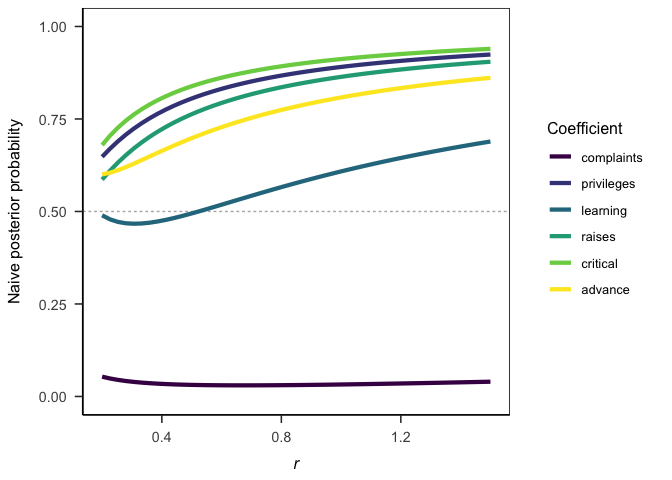

``` r
getwd()
```

    ## [1] "/Users/frederikaust/Documents/projects/jab"

<!-- README.md is generated from README.Rmd. Please edit that file -->

# jab: Automagic computation of Jeffrey’s approxiamte Bayes factors

<!-- badges: start -->

[](https://CRAN.R-project.org/package=jab)
[](https://lifecycle.r-lib.org/articles/stages.html#experimental)
<!-- badges: end -->

The goal of **jab** is to conveniently calculate Jeffrey’s approximate
Bayes factor \[JAB; (**Wagenmakers2022?**)\] for a wide variety of
statistical analyses.

## Installation

You can install the development version of **jab** like so:

``` r
remotes::install_github("crsh/jab")
```

## Example

**jab** automatically supports calculation of JAB for any analysis that
outputs a [Wald test](https://en.wikipedia.org/wiki/Wald_test) and for
which [**broom**](https://github.com/tidymodels/broom/) returns estimate
and standard error. The user additionally needs to specify a prior
distribution for the effect size estimate in the scale used to calculate
the Wald statistic.

Take the example of standard linear regression. JAB can be easily
calculated for all regression coefficients. We simply submit the results
from the orthodox frequentist analysis to `jab()` and specify a prior
distribution—let’s use a scaled central Cauchy distribution. Note that
JAB gives evidence for the null hypothesis relative to the alternative.

``` r
library("jab")

data(attitude)
attitude_lm <- lm(rating ~ ., data = attitude)
attitude_p <- broom::tidy(attitude_lm)

attitude_p
#> # A tibble: 7 × 5
#>   term        estimate std.error statistic  p.value
#>   <chr>          <dbl>     <dbl>     <dbl>    <dbl>
#> 1 (Intercept)  10.8       11.6       0.931 0.362   
#> 2 complaints    0.613      0.161     3.81  0.000903
#> 3 privileges   -0.0731     0.136    -0.538 0.596   
#> 4 learning      0.320      0.169     1.90  0.0699  
#> 5 raises        0.0817     0.221     0.369 0.715   
#> 6 critical      0.0384     0.147     0.261 0.796   
#> 7 advance      -0.217      0.178    -1.22  0.236

attitude_jab <- jab(
  attitude_lm
  , prior = dcauchy
  , location = 0
  , scale = sqrt(2) / 4
)

attitude_jab
#> [1] 23.104487868  0.007801082  2.945150346  0.786221082  1.968898371
#> [6]  2.947779545  1.630622716
```

Let’s compare this with the Jeffreys-Zellner-Siow (JZS) Bayes factor
from `BayesFactor::regressionBF()` with the same prior distribution.

``` r
attitude_jzs <- BayesFactor::regressionBF(
  rating ~ .
  , data = attitude
  , rscaleCont = sqrt(2) / 4
  , whichModels = "top"
  , progress = FALSE
)

tibble::tibble(
  # Frequentist p-values
  p = attitude_p$p.value
  
  # Bayes factors in favor of the null hypothesis
  , jab = attitude_jab
  , jzs = c(NA, rev(as.vector(attitude_jzs)))
  
  # Naive posterior probabilities
  , jab_pp = jab / (jab + 1)
  , jzs_pp = jzs / (jzs + 1)
)
#> # A tibble: 7 × 5
#>          p      jab     jzs  jab_pp  jzs_pp
#>      <dbl>    <dbl>   <dbl>   <dbl>   <dbl>
#> 1 0.362    23.1     NA      0.959   NA     
#> 2 0.000903  0.00780  0.0231 0.00774  0.0225
#> 3 0.596     2.95     2.92   0.747    0.745 
#> 4 0.0699    0.786    0.727  0.440    0.421 
#> 5 0.715     1.97     3.13   0.663    0.758 
#> 6 0.796     2.95     3.23   0.747    0.764 
#> 7 0.236     1.63     1.73   0.620    0.634
```

Pretty close!

### Varying prior distributions

To vary the scale of the prior distribution, simply pass a vector of
scaling parameters, one scale for each coefficient.

``` r
jab(
  attitude_lm
  , prior = dcauchy
  , location = 0
  , scale = c(rep(0.5, 3), rep(sqrt(2) / 4, 4))
)
#> [1] 16.354871486  0.006892498  4.079806887  0.786221082  1.968898371
#> [6]  2.947779545  1.630622716
```

### Prior sensitivity

Similarly, performing a prior sensitivity analysis is straight forward
and fast.

``` r
r <- seq(0.2, 1.5, length.out = 50)

jab_sensitivity <- tibble::tibble(
  r = rep(r, each = length(coef(attitude_lm)))
  , coef = rep(names(coef(attitude_lm)), 50)
  , jab = jab(
    attitude_lm
    , prior = dcauchy
    , location = 0
    , scale = r
  )
)

library("ggplot2")

ggplot(jab_sensitivity) +
  aes(x = r, y = jab / (1 + jab), color = coef) +
  geom_hline(yintercept = 0.5, linetype = "22", color = grey(0.7)) +
  geom_line(linewidth = 2) +
  scale_color_viridis_d(option = "E") +
  labs(
    x = bquote(italic(r))
    , y = "Naive posterior probability"
    , color = "Coefficient"
  ) +
  papaja::theme_apa()
```



## Package dependencies


