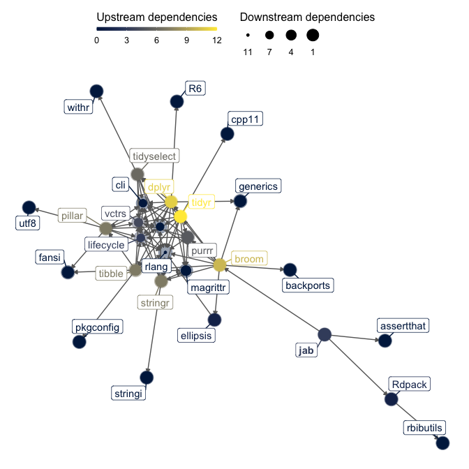

<!-- README.md is generated from README.Rmd. Please edit that file -->

# jab: Automagic computation of Jeffrey’s approxiamte Bayes factors

<!-- badges: start -->

[](https://CRAN.R-project.org/package=jab)
[](https://lifecycle.r-lib.org/articles/stages.html#experimental)
<!-- badges: end -->

The goal of **jab** is to conveniently calculate Jeffrey’s approximate
Bayes factor (JAB; [Wagenmakers, 2022](https://psyarxiv.com/egydq)) for
a wide variety of statistical analyses.

## Installation

You can install the development version of **jab** like so:

``` r
remotes::install_github("crsh/jab")
```

## Example

**jab** automatically supports calculation of JAB for any analysis that
outputs a [Wald test](https://en.wikipedia.org/wiki/Wald_test) and for
which [**broom**](https://github.com/tidymodels/broom/) returns an
estimate and a standard error. The user additionally needs to specify a
prior distribution for estimate in the scale used to calculate the Wald
statistic.

Take the example of standard linear regression. JAB can be easily
calculated for all regression coefficients. We simply submit the results
from the orthodox frequentist analysis to `jab()` and specify a prior
distribution—let’s use a scaled central Cauchy distribution. Note that
JAB gives evidence for the null hypothesis relative to the alternative.

``` r
library("jab")
library("ggplot2")

# Fit regression model
data(attitude)
attitude_z <- data.frame(scale(attitude))
attitude_lm <- lm(rating ~ 0 + ., data = attitude_z)
attitude_tidy_lm <- broom::tidy(attitude_lm)

attitude_tidy_lm
#> # A tibble: 6 × 5
#>   term       estimate std.error statistic  p.value
#>   <chr>         <dbl>     <dbl>     <dbl>    <dbl>
#> 1 complaints   0.671      0.172     3.89  0.000694
#> 2 privileges  -0.0734     0.134    -0.550 0.588   
#> 3 learning     0.309      0.159     1.94  0.0640  
#> 4 raises       0.0698     0.185     0.377 0.710   
#> 5 critical     0.0312     0.117     0.267 0.792   
#> 6 advance     -0.183      0.147    -1.24  0.225

# Specify prior distribution and approximate Bayes factor
attitude_jab <- jab(
  attitude_lm
  , prior = dcauchy
  , location = 0
  , scale = sqrt(2) / 4
)

attitude_jab
#>  complaints  privileges    learning      raises    critical     advance 
#> 0.006098194 2.975507681 0.745614530 2.315499227 3.684206278 1.758978762
```

Now compare this with the Jeffreys-Zellner-Siow (JZS) Bayes factor from
`BayesFactor::regressionBF()` with the same prior distribution.

``` r
# Calculate JZS-Bayes factor
attitude_jzs <- BayesFactor::regressionBF(
  rating ~ .
  , data = attitude
  , rscaleCont = sqrt(2) / 4
  , whichModels = "top"
  , progress = FALSE
)

# Compare results
tibble::tibble(
  predictor = attitude_tidy_lm$term
  
  # Frequentist p-values
  , p = attitude_tidy_lm$p.value
  
  # Bayes factors in favor of the null hypothesis
  , jab = attitude_jab
  , jzs = rev(as.vector(attitude_jzs))
  
  # Naive posterior probabilities
  , jab_pp = jab / (jab + 1)
  , jzs_pp = jzs / (jzs + 1)
)
#> # A tibble: 6 × 6
#>   predictor         p     jab    jzs  jab_pp jzs_pp
#>   <chr>         <dbl>   <dbl>  <dbl>   <dbl>  <dbl>
#> 1 complaints 0.000694 0.00610 0.0231 0.00606 0.0225
#> 2 privileges 0.588    2.98    2.92   0.748   0.745 
#> 3 learning   0.0640   0.746   0.727  0.427   0.421 
#> 4 raises     0.710    2.32    3.13   0.698   0.758 
#> 5 critical   0.792    3.68    3.23   0.787   0.764 
#> 6 advance    0.225    1.76    1.73   0.638   0.634
```

Pretty close!

### Varying prior distributions

To vary the scale of the prior distribution, simply pass a vector of
scaling parameters, one scale for each coefficient.

``` r
jab(
  attitude_lm
  , prior = dcauchy
  , location = 0
  , scale = c(rep(0.5, 3), rep(sqrt(2) / 4, 3))
)
#> complaints privileges   learning     raises   critical    advance 
#> 0.00524969 4.12100454 0.82624628 2.31549923 3.68420628 1.75897876
```

### Prior sensitivity

Similarly, performing a prior sensitivity analysis is straight forward
and fast.

``` r
# Specify design
jab_sensitivity <- expand.grid(
  coef = names(coef(attitude_lm))
  , r = seq(0.2, 1.5, length.out = 50)
) |>
  # Calculate Bayes factors for each prior setting
  dplyr::group_by(r) |>
  dplyr::mutate(
    jab = jab(
      attitude_lm
      , prior = dcauchy
      , location = 0
      , scale = r
    )
  )

# Plot results
ggplot(jab_sensitivity) +
  aes(x = r, y = jab / (1 + jab), color = coef) +
  geom_hline(
    yintercept = 0.5
    , linetype = "22"
    , color = grey(0.7)
  ) +
  geom_line(linewidth = 1.5) +
  scale_color_viridis_d() +
  lims(y = c(0, 1)) +
  labs(
    x = bquote(italic(r))
    , y = "Naive posterior probability"
    , color = "Coefficient"
  ) +
  papaja::theme_apa(box = TRUE)
```


### Sequential analyses

Sequential analyses are also a breeze.

``` r
# Specify design
sequential_jab <- expand.grid(
  coef = names(coef(attitude_lm))
  , n = 10:nrow(attitude_z)
) |>
  # Calculate Bayes factors for each subsample
  dplyr::group_by(n) |>
  dplyr::mutate(
    jab = jab(
      update(attitude_lm, data = attitude_z[1:unique(n), ])
      , dcauchy
      , location = 0
      , scale = sqrt(2) / 4
    )
    , jab_pp = jab / (jab + 1)
  )

# Plot results
ggplot(sequential_jab) +
  aes(x = n, y = jab_pp, color = coef) +
  geom_line(linewidth = 1.5) +
  scale_color_viridis_d() +
  lims(y = c(0, 1)) +
  labs(
    x = bquote(italic(n))
    , y = "Naive posterior probability"
    , color = "Coefficient"
  ) +
  papaja::theme_apa(box = TRUE)
```


## Package dependencies


